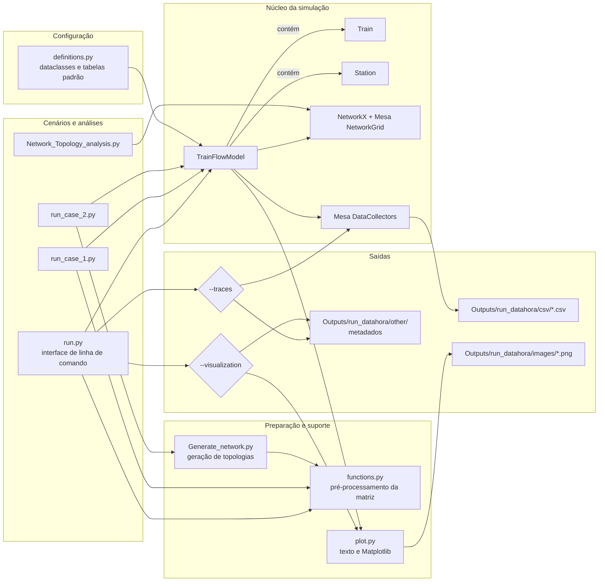
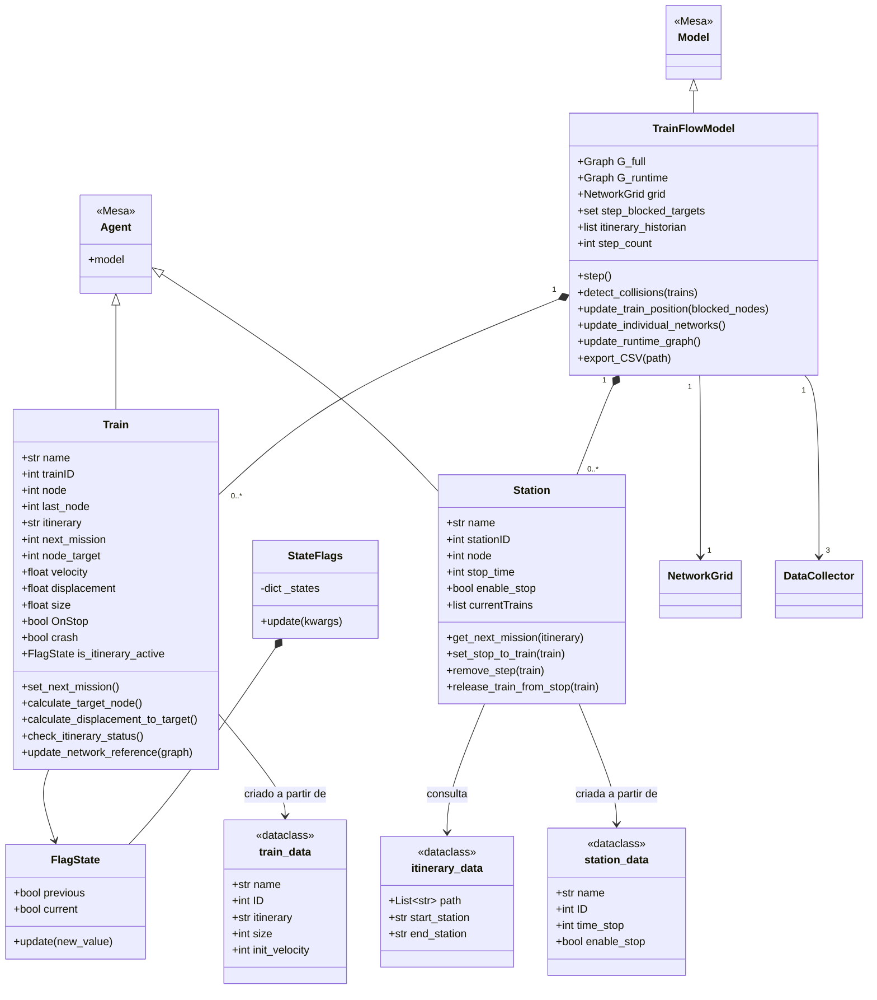
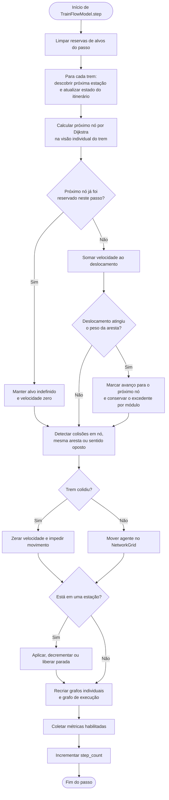
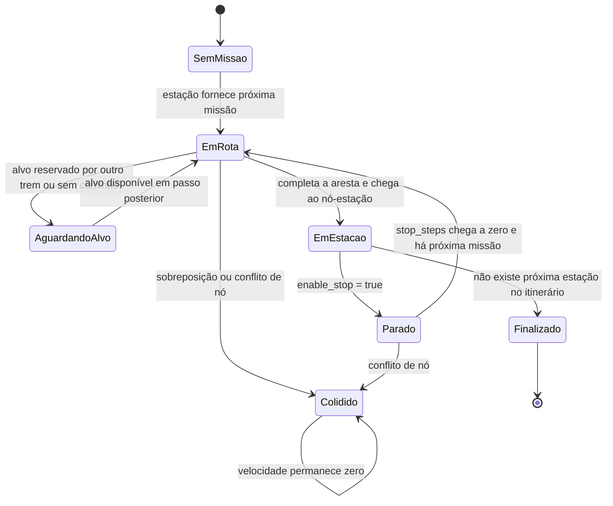

# Train Dynamics — documentação técnica

## 1. Visão geral

O **Train Dynamics** é um simulador ferroviário discreto, baseado em agentes, no qual a malha é representada por um grafo ponderado e cada trem decide como avançar entre estações ao longo de um itinerário. O projeto combina:

- **Mesa** para o modelo baseado em agentes e os coletores de dados;
- **NetworkX** para representar a rede ferroviária, calcular caminhos mínimos e manipular bloqueios;
- **NumPy** para converter matrizes de adjacência em grafos;
- **Pandas** para estruturar e exportar métricas em CSV;
- **Matplotlib** para visualizar a rede e seu estado ao longo da simulação.

O simulador trabalha em passos discretos. Em cada passo, os trens determinam sua próxima missão, selecionam o próximo nó por Dijkstra, acumulam deslocamento na aresta, mudam de nó quando completam a distância, interagem com estações, verificam colisões e registram métricas.

Esta documentação descreve o estado atual observado no código-fonte. Alguns nomes e comentários misturam português e inglês; aqui os termos originais são preservados quando correspondem a classes, atributos ou arquivos.

## 2. Objetivo e escopo atual

O projeto permite estudar o comportamento de trens em redes com ramificações, convergências e trajetos concorrentes. O núcleo atual cobre:

- criação manual ou programática de topologias;
- associação de estações e trens a nós do grafo;
- itinerários formados por uma sequência de estações;
- cálculo de rota entre a estação atual e a próxima estação do itinerário;
- deslocamento simplificado com velocidade constante por passo;
- parada temporizada em estações;
- reserva do próximo nó dentro de um passo;
- bloqueio de áreas ocupadas na visão individual de cada trem;
- detecção de colisão em nós e em arestas;
- coleta e exportação de métricas;
- visualização estática da rede.

O modelo não representa, neste momento, aceleração, frenagem, sinalização ferroviária formal, capacidade de via, horários, prioridades de despacho ou mudanças dinâmicas de topologia completas. Há pontos de extensão no código para parte desses recursos.

## 3. Tecnologias e dependências

As importações presentes no repositório indicam estas dependências:

| Dependência | Uso no projeto |
|---|---|
| Python | Linguagem de implementação |
| `mesa` | `Model`, `Agent`, `NetworkGrid` e `DataCollector` |
| `networkx` | Grafos, Dijkstra, geradores de topologia e métricas de rede |
| `numpy` | Matrizes e conversão da matriz de adjacência |
| `pandas` | Tabelas auxiliares e exportação de resultados |
| `matplotlib` | Renderização estática do estado da rede |

As dependências diretas estão registradas e fixadas no `pyproject.toml`, garantindo que uma nova instalação solicite as mesmas versões usadas no ambiente de referência:

| Pacote | Versão fixada |
|---|---:|
| Python | `>=3.11,<3.12` (ambiente de referência: `3.11.7`) |
| Mesa | `3.2.0` |
| NetworkX | `3.1` |
| NumPy | `1.26.4` |
| Pandas | `2.1.4` |
| Matplotlib | `3.8.0` |
| Setuptools (build) | `68.2.2` |
| Wheel (build) | `0.41.2` |

O operador `==` fixa exatamente as versões das bibliotecas diretas. Dependências transitivas — bibliotecas instaladas por esses pacotes — continuam sendo resolvidas pelo instalador. Para reproduções científicas rigorosas, recomenda-se gerar adicionalmente um arquivo de lock a partir de um ambiente limpo.

## 4. Estrutura de pastas e arquivos

```text
Train_Dynamics/
├── classes/
│   ├── Agents.py                 # Agentes Station/Train e modelo TrainFlowModel
│   │                             # Inclui FlagState e StateFlags
│   ├── Generate_network.py       # Geradores de matrizes e cenários de rede
│   ├── functions.py              # Separação de topologia e metadados da diagonal
│   ├── plot.py                   # Saída textual e visualização Matplotlib
│   └── __init__.py
├── Configuration/
│   ├── definitions.py            # Dataclasses, tabelas padrão e consultas auxiliares
│   ├── config.py                 # Reservado; atualmente vazio
│   ├── Enuns.py                  # Reservado; atualmente vazio
│   └── __init__.py
├── Documentation/
│   └── README.md                 # Este documento
├── Logs/
│   └── run_case_2/               # Gerado sob demanda pelo cenário legado
├── Outputs/                      # Gerado sob demanda pela nova CLI
│   └── run_AAAAMMDD_HHMMSS/
│       ├── csv/                  # Métricas quando --traces é usado
│       ├── images/               # PNGs quando --visualization é usado
│       └── other/                # Metadados e outros artefatos auxiliares
├── Other Analysis/               # Diretório reservado, atualmente sem arquivos
├── run.py                        # CLI e cenário padrão da simulação
├── run_case_1.py                 # Cenário manual alternativo, 30 passos
├── run_case_2.py                 # Cenário gerado, 31 passos
├── Network_Topology_analysis.py  # Experimentos isolados com Watts–Strogatz
├── pyproject.toml                # Metadados e dependências fixadas
└── .gitignore                    # Exclui saídas, caches e arquivos locais
```

`Outputs/` e `Logs/` são criados somente quando necessários e estão ignorados pelo Git. Pastas `__pycache__`, arquivos `.pyc`, metadados de build, configurações locais de IDE e ambientes virtuais também são excluídos pelo `.gitignore`.

## 5. Conceitos centrais do domínio

### 5.1 Rede ferroviária

A rede é criada a partir de uma matriz de adjacência. Valores numéricos fora da diagonal representam conexões; o valor é convertido no atributo `weight` da aresta e funciona simultaneamente como:

1. custo usado pelo algoritmo de Dijkstra; e
2. comprimento percorrido pelo trem naquela aresta.

A implementação usa `nx.from_numpy_array`, que cria um grafo não direcionado (`Graph`) por padrão. Mesmo quando uma matriz manual parece expressar apenas uma direção, a topologia efetiva do modelo é não direcionada.

### 5.2 Diagonal enriquecida

Nos cenários, a diagonal da matriz não é usada apenas como peso. Uma célula pode conter:

```python
["S_A", "T_A"]
```

O primeiro item identifica a estação posicionada no nó e o segundo identifica o trem inicial. Antes de construir o grafo:

- `extrair_diagonal_principal` separa os nomes de estações e trens;
- `zerar_diagonal_principal` troca todas as listas por zero, removendo esses metadados da topologia numérica.

Essa convenção compacta topologia e posicionamento inicial em uma única estrutura, mas exige que os dois passos de pré-processamento sejam executados.

### 5.3 Estação

Uma `Station` ocupa um nó, conhece a tabela de itinerários e pode impor uma parada a um trem. Seus principais dados são nome, identificador, nó, duração da parada e indicador `enable_stop`.

Ao receber um trem recém-chegado, a estação configura `stop_steps`, zera velocidade e deslocamento e marca `OnStop`. Nos passos seguintes decrementa o contador e libera o trem quando ele chega a zero.

### 5.4 Trem

Um `Train` mantém duas dimensões de posição:

- `node`: último nó efetivamente ocupado no `NetworkGrid`;
- `displacement`: progresso acumulado na aresta entre `node` e `node_target`.

O trem possui ainda itinerário, próxima missão, velocidade inicial e atual, tamanho físico aproximado, flags de parada/chegada/colisão e uma referência à sua visão individual do grafo.

### 5.5 Itinerário e missão

Um itinerário (`itinerary_data`) contém uma lista ordenada de nomes de estações. Quando o trem está em uma estação, `set_next_mission` consulta a estação seguinte e converte seu nome para o nó correspondente. A missão é somente o próximo marco do itinerário, não o itinerário inteiro.

Entre duas estações consecutivas, o trem calcula o próximo salto com o menor caminho ponderado. Ao chegar a outra estação, a missão é atualizada.

### 5.6 Três representações do grafo

| Representação | Responsabilidade |
|---|---|
| `G_full` | Topologia-base criada na inicialização |
| `grid.G` | Grafo mantido pelo `NetworkGrid`, contendo os agentes posicionados |
| `G_runtime` | Cópia estrutural para visualização, sem as arestas ocupadas por trens em movimento |

Além delas, cada trem recebe a cada passo um `G_personal`: cópia de `G_full` da qual são removidas as arestas ligadas ao nó atual e ao alvo dos outros trens. Essa visão influencia a próxima execução de Dijkstra.

## 6. Arquitetura



### Responsabilidades por camada

- **Entrada:** escolhe topologia, tabelas, número de passos e habilita explicitamente traces e visualizações.
- **Configuração:** define os dados estáticos necessários para instanciar estações, trens e itinerários.
- **Domínio/simulação:** contém estados e regras de movimento, parada, roteamento, bloqueio e colisão.
- **Infraestrutura analítica:** quando habilitada pelas flags, coleta métricas e materializa CSV, PNG e metadados na pasta exclusiva da execução.

## 7. Diagrama de classes

O diagrama prioriza as relações usadas pelo núcleo; métodos auxiliares simples foram agrupados para manter a leitura.



`FlagState` e `StateFlags` ficam em `classes/Agents.py`, junto dos agentes que consomem esse estado. `StateFlags` existe como agrupador genérico, mas o fluxo atual instancia `FlagState` diretamente no trem. O modelo configura quatro `DataCollector`: métricas gerais, eventos de itinerário, dados de trens e dados de estações.

## 8. Algoritmo principal de simulação



### Ordem exata de um passo

1. `step_blocked_targets` é limpo.
2. Cada trem consulta a estação presente em seu nó, define `next_mission` e registra transições do itinerário.
3. Cada trem que precisa de novo alvo executa Dijkstra, escolhe o segundo nó do caminho e tenta reservá-lo no passo.
4. Trens fora de parada acumulam `velocity` em `displacement`.
5. Quando `displacement >= weight`, o trem fica apto a mudar de nó; o excedente é preservado por `displacement % weight`.
6. O modelo testa colisões par a par.
7. Trens aptos e não colididos são movidos no `NetworkGrid`.
8. Estações identificam trens no mesmo nó, aplicam uma nova parada ou decrementam uma parada existente.
9. O modelo reconstrói as visões individuais dos trens e `G_runtime`.
10. Os coletores registram métricas, se `LogMetrics=True`.
11. `step_count` é incrementado.

### Complexidade aproximada

Se `T` é a quantidade de trens, `V` a quantidade de nós e `E` a quantidade de arestas:

- roteamento: até `T × O((V + E) log V)` por recálculo de Dijkstra;
- detecção de colisões: `O(T²)`, pois compara pares de trens;
- grafos individuais: aproximadamente `O(T × (V + E) + T² × grau)`, devido às cópias e remoções;
- coleta e operações de estação: predominantemente lineares em trens e estações.

Em redes pequenas isso é adequado para exploração. Em redes grandes, cópias completas de grafo por trem e por passo devem ser o primeiro alvo de otimização.

## 9. Estados relevantes do trem



Este é um modelo conceitual derivado das flags atuais, não uma máquina de estados explícita no código.

## 10. Inicialização de um cenário

O fluxo comum dos três scripts de execução é:

```python
edges_description = zerar_diagonal_principal(adj_matrix)
station_nodes, train_nodes = extrair_diagonal_principal(adj_matrix)

model = TrainFlowModel(
    edges_description,
    station_nodes,
    train_nodes,
    TRAIN_TABLE,
    STATION_TABLE,
    ITINERARY_TABLE,
)

for step in range(n_steps):
    model.step()
```

Na construção do modelo:

1. a matriz numérica é convertida em grafo;
2. nomes de estações e trens são anexados aos atributos dos nós;
3. agentes são criados em lote pelas APIs do Mesa;
4. cada agente é posicionado pelo nome indicado na diagonal original;
5. coletores de métricas são configurados.

Os nomes usados na diagonal devem existir nas tabelas correspondentes. Uma inconsistência não gera necessariamente um erro imediato; pode resultar em um agente não posicionado.

## 11. Cenários existentes

### `run.py`

Define uma rede de dez nós com quatro estações e dois trens configurados nas tabelas padrão. Também funciona como interface de linha de comando: permite controlar passos, seed, traces e visualizações. Sem argumentos, executa 100 passos sem coletar métricas, abrir gráficos ou criar artefatos. As saídas só são habilitadas pelas flags correspondentes.

### `run_case_1.py`

Contém três variações documentadas de uma rede pequena para estudar manobras; a variação ativa possui seis nós. Executa 30 passos e visualiza o estado, mas não exporta CSV ao final.

### `run_case_2.py`

Usa `criar_rede_completa(n=3, i=1, z=3, p=100)` para criar três entradas, um nó intermediário e três saídas. Também cria dinamicamente tabelas de trens e itinerários, executa 31 passos e exporta para `Logs/run_case_2`.

### `Network_Topology_analysis.py`

É um experimento independente do simulador. Compara redes Watts–Strogatz para diferentes probabilidades de reconexão, calcula clustering e caminho médio, mostra matrizes de adjacência e compara um caso com Erdős–Rényi.

## 12. Geração de topologias

`classes/Generate_network.py` oferece três grupos de recursos:

- `gerar_matriz_adjacencia_1`: fachada para diversas topologias do NetworkX, como Erdős–Rényi, Watts–Strogatz, Barabási–Albert, regular, geométrica, bipartida, completa, estrela, roda, grade, hipercubo e outras;
- `gerar_matriz_adjacencia_2`: cria uma rede em camadas com entrada, dois grupos intermediários e saída;
- `criar_rede_completa`: cria uma rede ferroviária completa entre nós de entrada, intermediários e saída, já incluindo metadados de estações/trens e tabelas de itinerários.

`visualizar_matriz_adjacencia` imprime a matriz, dimensão e densidade. `insert_random_nones` ajuda a preencher uma lista de posições com nós intermediários vazios.

## 13. Roteamento e prevenção de conflitos

### Dijkstra

`Train.calculate_target_node` calcula o menor caminho entre o nó atual e `next_mission`, usando `weight`. Apenas o próximo nó do caminho é guardado em `node_target`; a rota completa não fica congelada, podendo ser recalculada conforme a rede individual muda.

### Reserva por passo

`step_blocked_targets` impede que dois trens selecionem o mesmo novo alvo durante a mesma iteração de cálculo. A ordem de `Train_agents` atua, portanto, como prioridade implícita.

### Visão individual

Ao final de cada passo, para cada trem, o modelo copia `G_full` e remove as arestas incidentes ao nó e ao alvo de todos os outros trens. O trem usa essa cópia no roteamento posterior. Trata-se de uma restrição conservadora: em vez de bloquear só a aresta ocupada, bloqueia todas as saídas dos nós considerados ocupados ou reservados.

### Grafo de execução

`G_runtime` é voltado à visualização. Ele remove a aresta entre `node` e `node_target` para cada trem em movimento. Trens em parada ou sem alvo não removem arestas nesse grafo.

A criação usa `Graph.copy()`, copiando a estrutura de nós, arestas e atributos sem duplicar profundamente os agentes Mesa. Isso evita recursão sobre as referências circulares entre agente, modelo, `NetworkGrid` e grafo. Como `G_runtime` apenas remove arestas para visualização, a cópia estrutural é suficiente e não modifica `grid.G`.

## 14. Modelo de movimento e colisões

O movimento atual usa velocidade constante:

```text
deslocamento_novo = deslocamento_anterior + velocidade
```

Quando o deslocamento atinge o peso/comprimento da aresta, o trem pode avançar para o nó seguinte. Não existe cálculo de aceleração ou distância de frenagem.

A colisão é detectada aos pares nos seguintes casos:

- trens na mesma aresta e mesma direção, com intervalos físicos sobrepostos;
- trens na mesma aresta e sentidos opostos, após converter uma posição para o referencial inverso;
- trens no mesmo nó;
- alvo de um trem igual ao nó ocupado pelo outro.

O tamanho do trem é usado como metade do intervalo para cada lado de `displacement`. Ao colidir, ambos recebem `crash=True` e `velocity=0`; não há recuperação automática ou remoção do cenário.

## 15. Métricas e saídas

Na CLI de `run.py`, coleta e visualização são opt-in: não são executadas apenas porque o modelo foi iniciado. Essa separação evita o custo de coleta, serialização ou renderização em execuções que não precisam desses artefatos.

| Flag | Coleta métricas | CSV | Salva PNG | Abre janelas | Metadados |
|---|---:|---:|---:|---:|---:|
| nenhuma | não | não | não | não | não |
| `--traces` | sim | sim | não | não | sim |
| `--visualization` | não | não | sim | não | sim |
| flags combinadas | conforme flags | conforme flags | conforme flags | não | sim |

### Métricas do modelo

- número de trens;
- velocidade média;
- número de trens colididos;
- tempo simulado (`step_count × STEP_SCALE`);
- histórico de duração de itinerários.

### Métricas dos trens

Tipo, nome, nó, nó anterior, próxima missão, itinerário, ID, tamanho, colisão, parada, velocidade e tempo.

### Métricas das estações

Tipo, nome, nó, ID, tempo de parada, habilitação de parada, trens presentes e tempo.

### Arquivos CSV

Quando `--traces` é informado, `export_CSV(path)` cria na subpasta `csv/`:

| Arquivo | Conteúdo |
|---|---|
| `trains.csv` | Série temporal dos agentes do tipo trem |
| `stations.csv` | Série temporal dos agentes do tipo estação |
| `model.csv` | Indicadores agregados por passo |
| `model_events.csv` | Histórico coletado de itinerários |

### Visualização

- `print_network_state` detalha nós, agentes, atributos e arestas no terminal;
- `plot_network_state` usa Matplotlib e destaca estações, trens, colisões e arestas removidas de `G_runtime`;

Em `run.py`, `--visualization` salva cada figura e chama `plt.close()` imediatamente, sem executar `plt.show()`. Dessa forma, todos os passos são processados em sequência sem exigir que o usuário feche janelas. Os cenários legados ainda chamam a visualização diretamente.

## 16. Interface de linha de comando

1. Use Python `3.11`; o ambiente de referência analisado utiliza Python `3.11.7`.
2. Na raiz do repositório, instale o projeto e as versões fixadas no `pyproject.toml`:

```powershell
& "C:\Users\eosjo\anaconda3\python.exe" -m pip install -e .
```

O modo editável (`-e`) permite alterar o código-fonte sem reinstalar o projeto. Para uma instalação convencional, use:

```powershell
& "C:\Users\eosjo\anaconda3\python.exe" -m pip install .
```

Antes de usar os exemplos abreviados com `python`, confirme o interpretador:

```powershell
python --version
```

Se o comando apontar para Python 3.13 ou outra instalação, execute `run.py` explicitamente com o ambiente de referência:

```powershell
& "C:\Users\eosjo\anaconda3\python.exe" run.py --help
```

### Consultar os comandos disponíveis

```powershell
python run.py --help
```

Depois da instalação editável, o mesmo menu pode ser acessado pelo comando instalado:

```powershell
train-dynamics --help
```

### Opções de `run.py`

| Opção | Padrão | Finalidade |
|---|---|---|
| `--steps N` | `100` | Define a quantidade de passos; aceita zero |
| `--seed N` | sem seed | Define a seed do modelo para reprodução |
| `--traces` | desabilitado | Habilita coleta de métricas e CSVs |
| `--visualization` | desabilitado | Salva PNGs sem abrir janelas Matplotlib |
| `--output-root PATH` | `Outputs` | Escolhe a raiz das pastas de execução |
| `--run-name NAME` | `run` | Define o prefixo da pasta da execução |
| `--print-state` | desabilitado | Imprime toda a rede depois de cada passo |

### Exemplos com o cenário `run.py`

Executar o cenário padrão sem coleta ou arquivos de saída:

```powershell
python run.py
```

Executar 30 passos com seed e coleta de métricas:

```powershell
python run.py --steps 30 --seed 42 --traces
```

Executar cinco passos, imprimir os estados e salvar os PNGs:

```powershell
python run.py --steps 5 --print-state --visualization
```

Coletar métricas e salvar gráficos na mesma execução:

```powershell
python run.py --steps 10 --traces --visualization
```

Escolher o nome e a raiz da execução:

```powershell
python run.py --steps 20 --traces --run-name benchmark --output-root Results
```

Executar sem traces e sem visualização — nenhuma pasta de saída será criada:

```powershell
python run.py --steps 20
```

O comando instalado pelo `pyproject.toml` aceita as mesmas opções. Por exemplo:

```powershell
train-dynamics --steps 30 --seed 42 --traces
```

Não existem mais mudanças forçadas do diretório de trabalho nem caminhos absolutos no código Python. O diretório padrão é calculado a partir da localização de `run.py`; caminhos fornecidos pelo usuário são expandidos e resolvidos com `pathlib.Path`.

### Estrutura de uma execução

Quando pelo menos uma das flags `--traces` ou `--visualization` é usada, a CLI cria uma pasta exclusiva. As três subpastas são sempre criadas para manter um contrato uniforme, mesmo quando alguma delas permanece vazia:

```text
Outputs/
└── run_20260816_183045/
    ├── csv/
    │   ├── trains.csv
    │   ├── stations.csv
    │   ├── model.csv
    │   └── model_events.csv
    ├── images/
    │   ├── network_step_0000.png
    │   └── network_step_0001.png
    └── other/
        └── run_metadata.json
```

O nome combina o cenário/prefixo e a data/hora local. Se duas execuções iniciarem no mesmo segundo, um sufixo numérico impede sobrescrita. `run_metadata.json` registra cenário, diretório, passos, seed, flags e horário de conclusão.

## 17. Convenções e invariantes importantes

- O índice da matriz corresponde ao identificador numérico do nó.
- Pesos válidos de aresta devem ser positivos.
- A diagonal enriquecida deve conter lista de dois itens: `[estação, trem]`.
- `None` significa ausência de estação ou trem naquele nó.
- Nomes da diagonal devem coincidir exatamente com as chaves/nomes das tabelas.
- O caminho de um itinerário usa nomes de estações, enquanto `next_mission` usa o número do nó.
- O peso da aresta representa custo de roteamento e distância física no mesmo valor.
- `STEP_SCALE` converte passos em tempo e também influencia configurações padrão de velocidade/parada.
- A ordem dos agentes influencia quem reserva primeiro um nó disputado.

## 18. Limitações e riscos técnicos observados

Estas observações descrevem o código atual e ajudam a orientar manutenção futura:

1. **Reprodutibilidade transitiva:** as dependências diretas estão fixadas no `pyproject.toml`, mas ainda não existe um arquivo de lock para todas as dependências indiretas.
2. **Testes:** não há suíte automatizada para movimento, colisões, itinerários ou geração de rede.
3. **Direção da rede:** `nx.from_numpy_array` cria grafo não direcionado; matrizes assimétricas não mantêm semântica direcional.
4. **Unidades:** peso, velocidade, tamanho e escala temporal não possuem contrato de unidades formalizado em todos os pontos.
5. **Prioridade implícita:** reserva de alvo depende da ordem da lista de trens, sem política explícita de despacho.
6. **Visão defasada:** grafos individuais são atualizados ao final do passo e usados no passo seguinte.
7. **Custo computacional:** cada trem recebe uma cópia completa do grafo a cada passo.
8. **Tratamento de erro:** inconsistências de configuração podem resultar em agentes não posicionados ou mensagens no terminal, sem validação inicial consolidada.
9. **Cenários legados:** `run_case_1.py` e `run_case_2.py` ainda mantêm seus parâmetros definidos no código e não usam a nova CLI.
10. **Código reservado ou experimental:** `config.py`, `Enuns.py`, `Station.update_grid` e `Other Analysis/` ainda não possuem implementação útil; há também imports duplicados/não utilizados.

## 19. Como estender o projeto

### Adicionar uma estação

1. Crie um `station_data` na tabela usada pelo cenário.
2. Posicione o nome da estação no primeiro item da diagonal do nó.
3. Inclua o nome nos itinerários que devem visitá-la.
4. Garanta que exista caminho ponderado entre as estações consecutivas.

### Adicionar um trem

1. Crie um `train_data` com nome e ID únicos.
2. Crie o itinerário referenciado por `train_data.itinerary`.
3. Posicione o nome do trem no segundo item da diagonal de seu nó inicial.
4. Garanta que a estação inicial do itinerário esteja nesse mesmo nó.

### Criar um cenário

Prefira encapsular os dados em uma função ou arquivo próprio, preparar a matriz com as funções auxiliares, instanciar `TrainFlowModel` e tornar número de passos, seed e saída configuráveis. Para experimentos comparáveis, passe uma seed e registre-a junto aos resultados.

## 20. Artefatos adicionais recomendados

Sugestão de ordem de criação:

1. **`Documentation/INSTALLATION.md`:** versões de Python, criação de ambiente virtual, instalação e solução de problemas por sistema operacional.
2. **Arquivo de lock:** dependências diretas e transitivas resolvidas para reprodução rigorosa do ambiente definido no `pyproject.toml`.
3. **`Documentation/SCENARIOS.md`:** catálogo de cenários, matriz/topologia, trens, itinerários, seed, objetivo e resultado esperado.
4. **`Documentation/DATA_DICTIONARY.md`:** unidade, tipo, origem e significado de cada campo dos CSVs e atributos do domínio.
5. **`Documentation/MODEL_ASSUMPTIONS.md`:** hipóteses físicas e operacionais, especialmente unidades, movimento discreto, ocupação de via e política de colisão.
6. **`Documentation/VALIDATION.md`:** casos analíticos simples e comparação entre resultado esperado e simulado.
7. **`Documentation/ADR/`:** registros de decisões arquiteturais, por exemplo “grafo direcionado ou não direcionado” e “peso como custo e distância”.
8. **`Documentation/API_REFERENCE.md`:** contratos públicos de classes e funções, argumentos, retornos, exceções e exemplos.
9. **`Documentation/TEST_PLAN.md`:** matriz de testes unitários, integração, regressão e desempenho.
10. **`Documentation/ROADMAP.md`:** evolução planejada para sinalização, despacho, aceleração/frenagem, eventos e escalabilidade.
11. **Esquema de configuração:** JSON Schema, YAML documentado ou dataclasses validadas para substituir matrizes e tabelas embutidas nos scripts.
12. **Relatório de experimento reproduzível:** seed, hash da versão, parâmetros, métricas e gráficos consolidados por execução.
13. **Guia de contribuição:** padrão de nomes, formatação, testes, branches e critérios de aceite.
14. **Changelog:** registro das alterações de comportamento do simulador e do formato dos dados.

## 21. Próximos passos de maior impacto

Para transformar o protótipo em uma base confiável de experimentação, a sequência mais valiosa seria:

1. gerar um arquivo de lock para fixar também as dependências transitivas;
2. migrar `run_case_1.py` e `run_case_2.py` para a mesma infraestrutura de CLI;
3. definir unidades e invariantes do modelo;
4. criar testes determinísticos para Dijkstra, paradas, colisões e término de itinerário;
5. validar configurações antes de criar agentes;
6. separar cenário, motor, visualização e persistência em módulos independentes;
7. tornar explícita a política de reserva/prioridade de trens;
8. medir desempenho antes de otimizar as cópias de grafos.

## 22. Glossário

| Termo | Significado no projeto |
|---|---|
| Nó | Posição discreta da rede no `NetworkGrid` |
| Aresta/via | Ligação ponderada entre dois nós |
| Peso | Custo para Dijkstra e comprimento usado no deslocamento |
| Missão | Próxima estação do itinerário, armazenada como nó-alvo final |
| `node_target` | Próximo nó imediato do caminho mínimo |
| `displacement` | Progresso do trem dentro da aresta atual |
| `G_full` | Topologia-base do modelo |
| `G_personal` | Topologia filtrada vista por um trem |
| `G_runtime` | Topologia para visualização de vias ocupadas |
| Step | Unidade discreta de atualização da simulação |
| `STEP_SCALE` | Fator que relaciona passos e tempo/configurações cinemáticas |

---

Documento gerado a partir da inspeção dos arquivos Python e dos artefatos presentes no repositório em **16 de agosto de 2026**.
